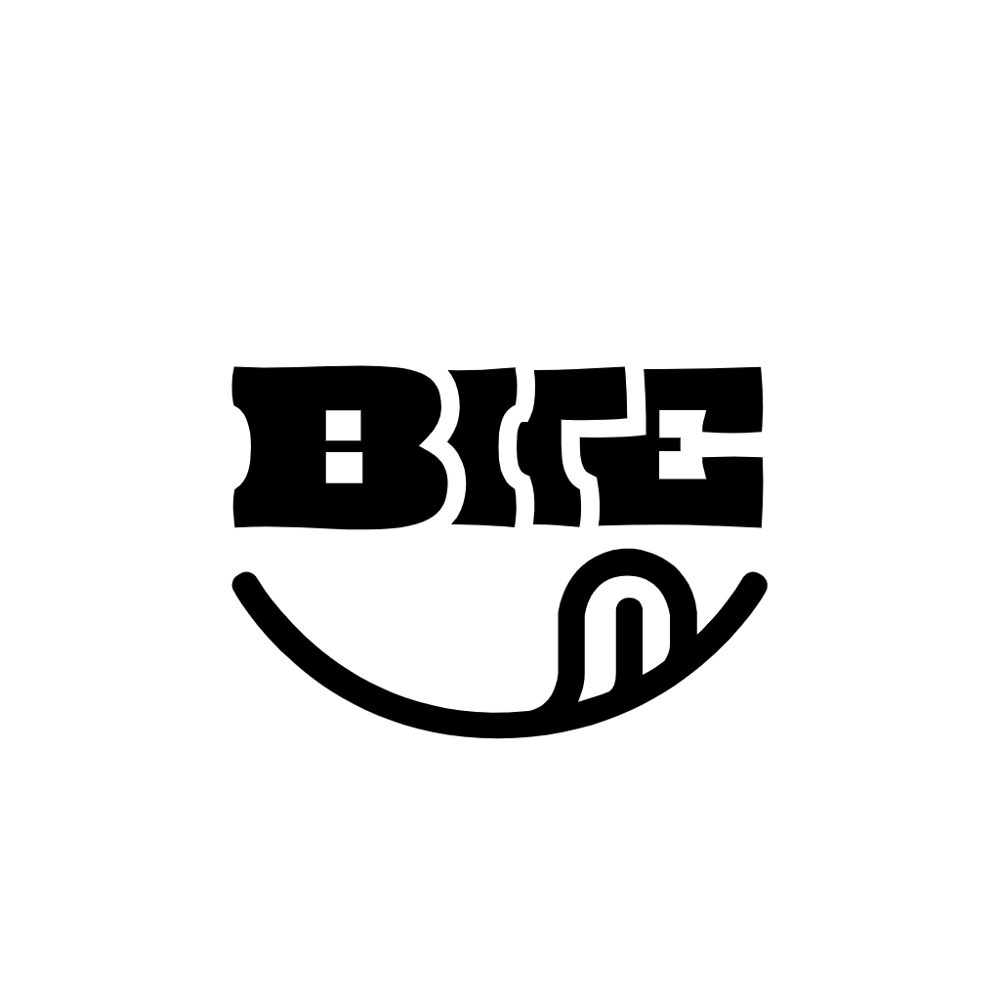

<p align="center">
  
</p>

# Bite 🍽️

> **"Describe what you ate. Let the AI do the rest."**

Bite is a modern, privacy-first, AI-powered nutrition and meal tracking application built with Flutter. It replaces tedious form-filling with natural language understanding and photo recognition—powered locally with offline-first storage and Google Gemini AI.

---

## 🌟 Key Features

- 🗣️ **Natural Language Logging**: Type naturally like *"One plate chicken biryani"*, *"2 eggs and toast"*, or *"Half bowl oats"*.
- 📸 **Photo & Multimodal Analysis**: Take a photo of your meal with optional context (*"Extra chicken, less rice"*) and let Gemini AI estimate nutrition & portions.
- 🧠 **Smart Meal Memory**: Favorite and save frequently eaten meals to log them with a single tap.
- 📊 **Real-time Dashboard & Macro Snapshot**: Instant visual feedback on daily calories, protein, carbs, and fat with animated progress indicators.
- 📅 **Google Calendar Style Month Slider**: Smooth, real-time horizontal page swiping across months with haptic feedback and automatic selected-date focusing.
- 📈 **Detailed Analytics & History**: Interactive 7-day, 4-week, and 3-month charts built with `fl_chart`, full text search, and chronological timeline view.
- 🔒 **Privacy & Offline First**: 100% of your meal history, settings, and photos stay on your device via **Isar DB**. Only individual meal inputs are processed by AI.
- 💾 **Full ZIP Backup & Smart Deduplicating Import**: Export your complete data to a ZIP file using Android's native File Saver menu. Smart deduplication overwrites matching meals while preserving app-only data.
- 🎨 **Material 3 Expressive UI**: Supports Light Mode, Dark Mode, System Theme, and custom color accents.

---

## 📸 Core UX Philosophy

Logging a meal in Bite takes **under 5 seconds**:

1. **Tap Log Meal** (or press Photo shortcut).
2. **Describe your meal** in natural words.
3. **Confirm AI estimates**—edit any portion or nutrient value if desired.

---

## 🛠️ Tech Stack

| Component | Technology | Description |
|---|---|---|
| **Framework** | **Flutter 3.44+** | Cross-platform UI engine |
| **Language** | **Dart 3.3+** | Strongly typed client code |
| **State Management** | **Flutter Riverpod 2.6** | Reactive state with code generation |
| **Navigation** | **GoRouter 14.6** | Declarative router with deep linking |
| **Database** | **Isar DB 3.1** | Ultra-fast, offline-first NoSQL database |
| **AI Intelligence** | **Google Gemini 2.5 Flash** | Structured JSON food & portion estimation |
| **Analytics & Charts** | **fl_chart** | High-performance interactive Flutter charts |
| **Design System** | **Material 3** | Adaptive dynamic color & micro-animations |

---

## 📂 Project Architecture

The project uses a **Feature-first** modular architecture following SOLID principles:

```
lib/
├── app.dart                   # Root MaterialApp configuration
├── main.dart                  # Entry point & service initialization
├── core/                      # Core infrastructure & shared utilities
│   ├── ai/                    # Gemini AI service integration
│   ├── database/              # Isar database service & schemas
│   ├── models/                # Meal, MealItem, AppSettings schemas
│   ├── providers/             # Global date & app state providers
│   ├── router/                # GoRouter navigation setup
│   ├── services/              # Backup & Notification services
│   ├── theme/                 # AppTheme & color schemes
│   └── widgets/               # Expressive sliders, macro rings, shell scaffold
└── features/                  # Independent feature modules
    ├── analytics/             # Weekly, monthly, macro trend charts
    ├── calendar/              # Google Calendar style month slider
    ├── dashboard/             # Home view, nutrition snapshot, timeline
    ├── history/               # Chronological journal & meal search
    ├── log_meal/              # Text & photo logging sheet
    ├── meal_detail/           # Detail view & meal editor
    ├── onboarding/            # Initial nutrition goals setup
    └── settings/              # Custom colors, goals, backup/restore, API key
```

---

## 🚀 Getting Started

### Prerequisites

- [Flutter SDK](https://docs.flutter.dev/get-started/install) (`>= 3.3.0`)
- Android Studio / VS Code with Flutter extension
- A free Gemini API Key from [Google AI Studio](https://aistudio.google.com)

### Installation

1. **Clone the repository**:
   ```bash
   git clone https://github.com/anubix05/BITE.git
   cd BITE
   ```

2. **Configure Environment API Key**:
   Create a `.env` file in the project root:
   ```env
   GEMINI_API_KEY=your_gemini_api_key_here
   ```
   *(Note: You can also enter or update your Gemini API Key directly inside the app's Settings screen).*

3. **Install Dependencies & Generate Code**:
   ```bash
   flutter pub get
   dart run build_runner build --delete-conflicting-outputs
   ```

4. **Run the App**:
   ```bash
   flutter run
   ```

---

## 📦 Building Production Release

To build optimized, split-per-ABI release APKs:

```bash
flutter build apk --release --split-per-abi
```

Generated APKs will be located at:
`build/app/outputs/flutter-apk/app-arm64-v8a-release.apk` (~21 MB)

---

## 🔒 Privacy & Data Ownership

- **Local Data Storage**: All your meals, nutritional data, personal settings, and photos are stored strictly on your device using Isar DB.
- **Zero Cloud Tracking**: No user data, analytics, or meal history is ever uploaded to external servers.
- **Data Export & Portability**: You own your data. Export your entire history anytime to a standard ZIP backup (`meals.json`, `settings.json`, and images).

---

## 📄 Version & License

- **Current Version**: `v1.3.1`
- **License**: Open Source / Personal Use

Developed with ❤️ using Flutter & Google Gemini AI.
